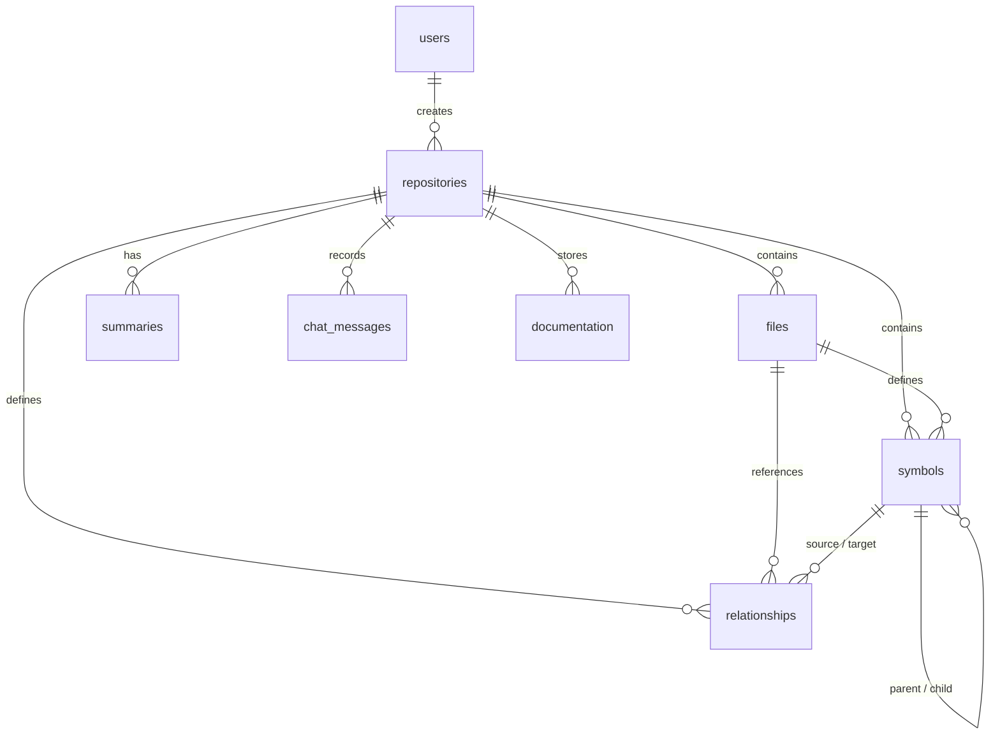

# CodeVista Server

The Node.js + Express 5 backend application for CodeVista. It handles repository lifecycle tasks (cloning Git repos, parsing archives), manages database records in SQLite, extracts code structures using AST parsers, maps symbol dependencies, and manages the LLM conversation and documentation pipelines via Groq.

---

## Architecture Overview

```
                        ┌────────────────────────┐
                        │      HTTP Client       │
                        └───────────┬────────────┘
                                    │
                                    ▼ [JSON / JWT]
                        ┌────────────────────────┐
                        │    Express Backend     │
                        └───────────┬────────────┘
                                    │
           ┌────────────────────────┼────────────────────────┐
           ▼                        ▼                        ▼
┌────────────────────┐    ┌────────────────────┐   ┌───────────────────┐
│ AST Parsing Engine │    │  Service Layer     │   │   SQLite DB       │
│  (Babel / Python)  │    │  (Git, ZIP, LLM)   │   │  (better-sqlite3) │
└────────────────────┘    └─────────┬──────────┘   └───────────────────┘
                                    │
                                    ▼ [Groq API]
                         ┌──────────────────────┐
                         │   LLaMA 3.3 (Groq)   │
                         └──────────────────────┘
```

The backend is structured into modular layers:
- **Routes & Controllers** (`src/routes/`) — Parses request arguments, applies validation schemas, and formats responses.
- **Middleware** (`src/middleware/`) — Enforces JWT verification, performs schema checking, manages error handling, and executes repository ownership rules.
- **Services** (`src/services/`) — Contains core backend logic, including the Git cloning wrapper, ZIP file manager, SQLite database queries, LLM prompting controllers, and background analysis queues.
- **Parsers** (`src/parsers/`) — Language-specific AST analysis components that parse source code and extract functions, routes, component blocks, imports, and exports.

---

## Configuration Variables

Copy [server/.env.example](file:///Users/mihir/Programming/Projects_Local/CodeVista/server/.env.example) to `.env` in the server root.

| Environment Variable | Description | Default Value |
| :--- | :--- | :--- |
| `PORT` | Port the Express server listens on. | `3001` |
| `NODE_ENV` | Application environment (`development` or `production`).| `development` |
| `GROQ_API_KEY` | Secret token to authenticate with Groq Cloud. | *(Required)* |
| `LLM_MODEL` | The default text model requested from the API. | `llama-3.3-70b-versatile`|
| `LLM_MAX_TOKENS` | Max tokens generated in completion answers. | `4096` |
| `LLM_TEMPERATURE` | Creativity temperature for code summaries & Q&A. | `0.3` |
| `REPOS_DIR` | Folder name where repositories are cloned/extracted. | `repos` |
| `UPLOADS_DIR` | Temp directory for uploaded ZIP archives. | `uploads` |
| `DATA_DIR` | Directory housing the SQLite database. | `data` |
| `CORS_ORIGIN` | Allowed Client CORS domains. | `http://localhost:5173` |
| `LLM_RATE_LIMIT_RPM` | Maximum LLM queries allowed per minute. | `30` |
| `LOG_LEVEL` | Morgan HTTP logging profile. | `dev` |

---

## SQLite Database Schema

The database relies on **better-sqlite3** with WAL (Write-Ahead Logging) and cascading foreign keys enabled.



### Table Schema Definitions

#### 1. `users`
Tracks registered accounts, hashes credentials, and maps linked GitHub credentials.
```sql
CREATE TABLE users (
  id              TEXT PRIMARY KEY,
  email           TEXT UNIQUE NOT NULL,
  password_hash   TEXT NOT NULL,
  groq_api_key    TEXT,
  github_username   TEXT,
  github_token      TEXT,
  created_at      TEXT NOT NULL DEFAULT (datetime('now')),
  updated_at      TEXT NOT NULL DEFAULT (datetime('now'))
);
```

#### 2. `repositories`
Metadata logs for imported folders, analysis states, and ownership flags.
```sql
CREATE TABLE repositories (
  id              TEXT PRIMARY KEY,
  user_id         TEXT REFERENCES users(id) ON DELETE CASCADE,
  name            TEXT NOT NULL,
  url             TEXT,
  type            TEXT NOT NULL CHECK(type IN ('git','upload')),
  status          TEXT NOT NULL DEFAULT 'pending' CHECK(status IN ('pending','cloning','analyzing','ready','error')),
  error_message   TEXT,
  language_stats  TEXT,            -- JSON string: { "js": 42, "py": 18, ... }
  total_files     INTEGER DEFAULT 0,
  total_symbols   INTEGER DEFAULT 0,
  is_verified_owner INTEGER DEFAULT 0,
  github_username   TEXT,
  created_at      TEXT NOT NULL DEFAULT (datetime('now')),
  updated_at      TEXT NOT NULL DEFAULT (datetime('now'))
);
```

#### 3. `files`
Raw code snapshot records stored for symbol extraction and syntax display.
```sql
CREATE TABLE files (
  id          TEXT PRIMARY KEY,
  repo_id     TEXT NOT NULL REFERENCES repositories(id) ON DELETE CASCADE,
  path        TEXT NOT NULL,       -- Relative path inside repo
  name        TEXT NOT NULL,       -- Basename
  extension   TEXT,                -- e.g. "js", "py", "tsx"
  size        INTEGER DEFAULT 0,
  content     TEXT,                -- Full source code
  parsed      INTEGER DEFAULT 0,   -- Boolean flag (0 or 1)
  created_at  TEXT NOT NULL DEFAULT (datetime('now'))
);
```

#### 4. `symbols`
Stores specific definitions extracted during AST analysis.
```sql
CREATE TABLE symbols (
  id                TEXT PRIMARY KEY,
  file_id           TEXT NOT NULL REFERENCES files(id) ON DELETE CASCADE,
  repo_id           TEXT NOT NULL REFERENCES repositories(id) ON DELETE CASCADE,
  name              TEXT NOT NULL,
  type              TEXT NOT NULL,   -- 'function', 'class', 'method', 'variable', 'import', 'export', 'route', 'component'
  start_line        INTEGER,
  end_line          INTEGER,
  signature         TEXT,            -- e.g. "function add(a, b)" or "class Router extends Controller"
  docstring         TEXT,            -- JSDoc / Docstring content
  parent_symbol_id  TEXT REFERENCES symbols(id) ON DELETE SET NULL,
  metadata          TEXT             -- JSON string containing params count, async flags, decorators, etc.
);
```

#### 5. `relationships`
Maps references linking two symbols or files together.
```sql
CREATE TABLE relationships (
  id                TEXT PRIMARY KEY,
  repo_id           TEXT NOT NULL REFERENCES repositories(id) ON DELETE CASCADE,
  source_symbol_id  TEXT REFERENCES symbols(id) ON DELETE CASCADE,
  target_symbol_id  TEXT REFERENCES symbols(id) ON DELETE CASCADE,
  source_file_id    TEXT REFERENCES files(id) ON DELETE CASCADE,
  target_file_id    TEXT REFERENCES files(id) ON DELETE CASCADE,
  type              TEXT NOT NULL    -- 'import', 'extends', 'implements', 'calls', 'uses'
);
```

#### 6. `summaries`
Maintains generated summaries at different hierarchical layers.
```sql
CREATE TABLE summaries (
  id          TEXT PRIMARY KEY,
  repo_id     TEXT NOT NULL REFERENCES repositories(id) ON DELETE CASCADE,
  level       TEXT NOT NULL CHECK(level IN ('file','module','repository')),
  target_id   TEXT,                -- file_id or NULL (for repository level)
  target_name TEXT,
  content     TEXT NOT NULL,
  created_at  TEXT NOT NULL DEFAULT (datetime('now'))
);
```

---

## AST Parser Engine Pipeline

When analysis starts for a repository, a background task performs the following steps:
1. **File Scan** — Iterates over all files on disk, filtering out binary data, `node_modules`, lockfiles, and hidden configuration subdirectories.
2. **Database Registration** — Saves file descriptors and text contents to the `files` table.
3. **AST Symbol Extraction**:
   - **JavaScript / TypeScript Parser** (`src/parsers/javascript-parser.js`) — Parses source code using `@babel/parser` with full JSX, TypeScript, decorators, class properties, and dynamic import plugins. Traverses the AST to extract imports, exports, class architectures, functions, routes (`app.get`), and React Components.
   - **Python Parser** (`src/parsers/python-parser.js`) — Parses Python syntax trees to identify classes, module imports, function blocks, variables, class methods, docstrings, and decorator bindings.
4. **Relationship Compiler** — Resolves module imports and references between files, populating the `relationships` table.
5. **Hierarchical Summary Engine**:
   - **File-Level** — Summarizes each source file based on its exports and dependencies.
   - **Module-Level** — Aggregates file summaries within each directory to describe folder-level responsibilities.
   - **Repository-Level** — Analyzes the visual directory tree structure alongside module summaries to produce a comprehensive codebase breakdown.

---

## LLM Orchestration & Fallback Chain

### Token Bucket Rate Limiting
To prevent hitting API rate limits, [llm-service.js](file:///Users/mihir/Programming/Projects_Local/CodeVista/server/src/services/llm-service.js) implements a local token-bucket rate limiter configured via `LLM_RATE_LIMIT_RPM` (default: 30 requests per minute). Excess requests are held in a queue, delaying execution until the limit resets.

### Resilient Fallback Chain
If the primary reasoning model (`llama-3.3-70b-versatile`) throws a rate limit error (HTTP 429), server overload error (HTTP 503), or model support error, the LLM service automatically retries the request using a fallback model chain:
1. **`llama-3.3-70b-versatile`** (Primary)
2. **`llama-3.1-8b-instant`** (Fast Failover)
3. **`meta-llama/llama-4-scout-17b-16e-instruct`** (Ultra-high throughput backup)

---

## Security Compliance & Ownership Verification

CodeVista implements strict security guardrails. During chat sessions, a custom system instruction is injected based on the repository's verification status:

> [!WARNING]
> If a user is **unverified**, the LLM will decline requests to identify security vulnerabilities, threats, or security loopholes in the codebase, directing the user to verify ownership.
>
> If a user is **verified**, the LLM is authorized to provide deep security auditing, identifying threat vectors, memory issues, logic exploits, and suggesting fixes.

### Ownership Verification Rules

Verification is completed via `POST /api/repositories/:id/verify`. It requires a `githubUsername` and optional `token` (Personal Access Token).
- **Git Repository URL** — Checked for ownership by verifying that the GitHub username matches the username in the repository URL. If the repository is private, a Personal Access Token can be provided.
- **Uploaded ZIP Archives** — Considered verified by default once a profile connection is established, as the archive was directly provided by the authenticated user.

---

## Running the Server

Start development mode with hot-reloading (uses `node --watch` in Node 20+):
```bash
# Install dependencies
npm install

# Run in development
npm run dev

# Run in production
npm start
```
